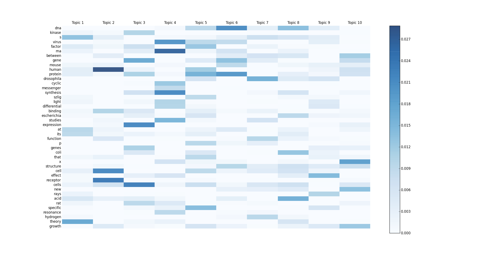
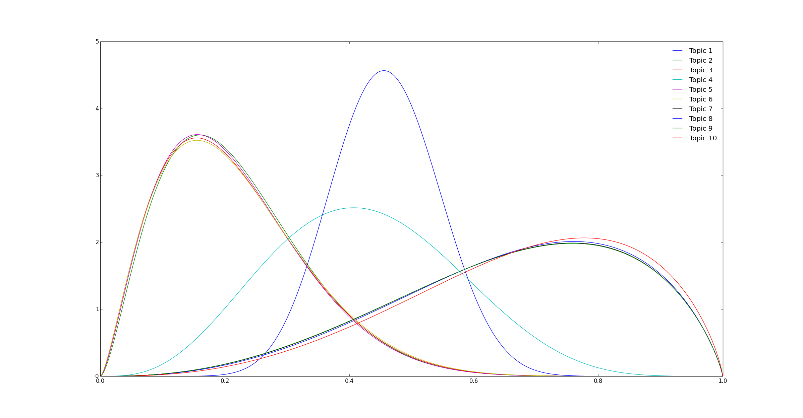

Topics Over Time
===========================================================

This is an open-source implementation of *A Non-Markov Continuous-Time Model of Topical Trends* by Xuerui Wang and Andrew McCallum. The paper associated each LDA topic with a beta distribution over timestamps which characterized the evolution of that topic with time.

Instructions
-----------------------------------------------------------

* Sanitize `main_pnas.py` and `visualize_pnas.py` to ensure all input directories, input files, and output directories are present.
* Run `python main_pnas.py` to execute Topics over Time algorithm.
* Run `python visualize_pnas.py` to visualize the topic-word distributions as well as the beta distributions showing evolution of topics with time.

Dataset
-----------------------------------------------------------
The code is tested on the PNAS titles dataset. The dataset can be found [here](http://www.cs.nyu.edu/~roweis/data/pnas_all.tar). The resulting model is pickled and stored in [the results folder](results/pnas_tot).

Results
-----------------------------------------------------------

* Topic Distributions for PNAS Titles Dataset

* Evolution of Topics for PNAS Titles Dataset

License
-----------------------------------------------------------

[GNU General Public License](GPL.md)

Copyright © 2015 Abhinav Maurya
